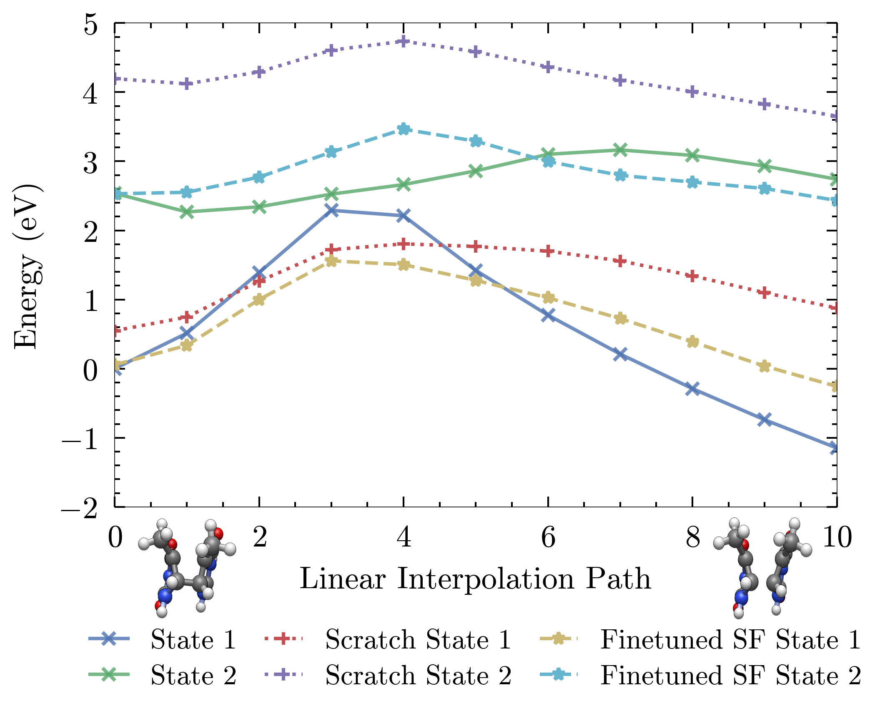
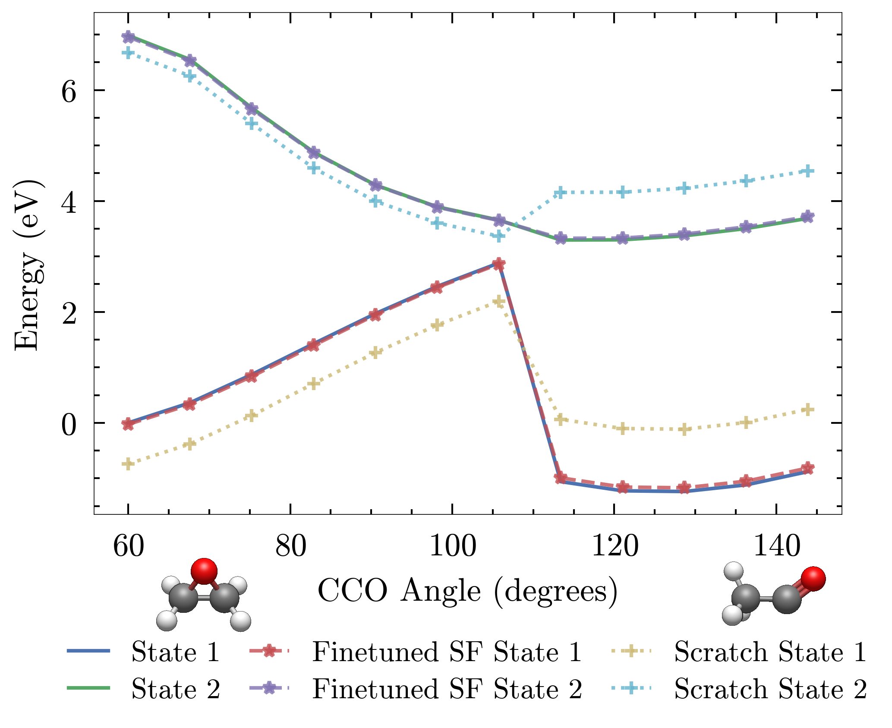

# Machine-Learned Interatomic Potentials for Photophysics

**Author:** Lucas Sanchez Garay  
**Institution:** Department of Physics, University of Warwick  
**Date:** 13 March 2025  

> This repository is the *code and data companion* to my undergraduate dissertation:
>  
> **Machine-Learned Interatomic Potentials for Photophysics**  
> Submitted: May 2025  
> PDF available in [`docs/Dissertation_Final_Report.pdf`](docs/Dissertation_Final_Report.pdf)

---

## 📖 Project Overview

This project investigates whether a short-range, equivariant graph neural network — **MACE-OFF23** — pre-trained on *ground-state* molecular data can be **fine-tuned** to accurately predict *excited-state* potential energy surfaces (PES) for ultrafast photophysical processes.

Two representative case studies were chosen:

- **Oxirane angle opening** — showcasing a strong **S₀/S₁ conical intersection** around 108°.
- **Thymine dimerisation** — exploring covalent C₅–C₅′ bond formation with varying distances and angles, highlighting **spin contamination** under SF-TDDFT.

This work combines **quantum chemistry calculations**, **machine learning**, and **molecular dynamics** to explore the feasibility of *transfer learning* from ground- to excited-state PES.

---

## 🎯 Motivation

Excited-state molecular dynamics is computationally expensive, with *ab initio* methods like SF-TDDFT or multireference approaches scaling poorly with system size.  
Machine-learned interatomic potentials (MLIPs) offer a route to bridge the gap:  
1. Train on a small set of high-fidelity data.  
2. Reuse pre-trained models to drastically reduce training cost.  
3. Preserve ground-state accuracy via **replay fine-tuning**.

---

## 🔬 Methods Summary

- **Electronic structure calculations**:  
  - **SF-TDDFT** (ORCA) for excited states  
  - **DFT** for ground-state forces where required
- **ML architecture**: MACE-OFF23 equivariant GNN
- **Training strategy**:  
  - **Replay fine-tuning** with a secondary output head for excited states  
  - **Active learning**: short MD bursts near crossing regions to sample challenging geometries  
- **Evaluation metrics**: RMSE in energies and forces; qualitative PES scans; MD trajectory stability

---

## 📊 Key Results

*(Figures are placeholders — replace with your images later)*

<p align="center">
  
  <br><em>Predicted Potential Energy Surface for thymine dimerisation, fine-tuned vs raw models.</em>
</p>

<p align="center">
  
  <br><em>Predicted Potential Energy Surface for oxirane's angle opening reaction, fine-tuned vs raw models.</em>
</p>

**Main findings:**
- Fine-tuned models achieve accuracy comparable to models trained from scratch, but with *far less data*.
- Replay fine-tuning helps mitigate catastrophic forgetting of ground-state accuracy.
- Capturing the **topology** of conical intersections still requires high-fidelity excited-state data.
---

## 🗂 Repository Structure

```
.
├── docs/                       # Dissertation PDF + figure exports
├── mace-suite/                 # Adapted MACE library, datasets and runs for each model/system
├── oxirane/                    # Scripts/data for oxirane case study (isolated geometry optimisations and Spin-Flip energy calculations)
├── thymine/                    # Scripts/data for thymine dimerisation case study (isolated geometry optimisations and Spin-Flip energy calculations)
├── results/                    # Results from testing suite plotted to measure energy RMSE error per state, MD approximation by model and Potential Energy Surface predictions
├── testing-suite/              # MD simulations and ORCA energy calculations on some snapshots as ground truth
├── wrappers/                   # Helper functions and job submission wrappers for ORCA jobs
└── .gitattributes
```

---

## 📄 The Dissertation

The full written dissertation can be found at:

[`docs/Dissertation_Final_Report.pdf`](docs/Dissertation_Final_Report.pdf)

It contains:
- Detailed theoretical background
- Computational setup and parameters
- Full results & discussion
- All original figures

---

## ⚙️ Running the Code

This repo is **not** designed as a polished software package — it is a research archive.  
However, if you wish to reproduce results or explore the code:

1. Install Python 3.10 and the following packages:
   ```bash
   pip install numpy scipy matplotlib pandas jupyter tqdm
   pip install torch ase mace-torch
   ```
2. Place your own ORCA executables path in the `wrappers/orca_wrappers` in the `orca_profile` line if regenerating TDDFT data.
3. Explore scripts in `oxirane/` and `thymine/` for data generation
4. Explore scripts in `mace-suite/runs` for model training
5. `testing-suite/` and `results/` contain useful evaluation metrics used 

---

## 📚 Citation

If referencing this work:

> **Lucas Sanchez Garay** (2025), *Machine-Learned Interatomic Potentials for Photophysics*. Department of Physics, University of Warwick, Coventry CV4 7AL, United Kingdom. Submitted: 13 March 2025.

---

## 🙏 Acknowledgements

- Supervision & guidance from my project supervisor Professor Nicholas Hine
- MACE developers for the open-source MLIP framework  
- ORCA developers for making high-quality quantum chemistry accessible

